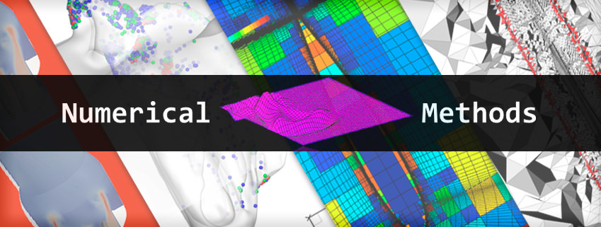

# RMUTT 09131201
Offical Repository of RMUTT 09131201 Numerical Methods for Computers

Lecturers:
 - Wongwisarut Kuangsatung, Asst.Prof.Dr.
 - Ratthaprom Promkam, Dr.rer.nat




## Schedules

SEMESTER 1/2565

| Section | Date    | Lecture  | Workshop |
|---------|---------|----------|----------|
|  SEC01  | WED     |ST1910 08.00 - 10.00 | ST1905 10.00 - 12.00 |
|  SEC02  | TUE     |ST1910 13.00 - 15.00 | ST1905 15.00 - 17.00 |
|  SEC03  | TUE     |ST1910 08.00 - 10.00 | ST1905 10.00 - 12.00 |

Quiz-1 Exam: TBA

Midterm Exam: TBA

Quiz-2 Exam: TBA

Final Exam: TBA

## Course Description

เครื่องมือสำหรับแก้ปัญหาเชิงตัวเลข การวิเคราะห์ความคลาดเคลื่อน ผลเฉลยของสมการแบบไม่เชิงเส้น ผลเฉลยของระบบสมการเชิงเส้น การประมาณค่าในช่วง การประมาณค่ากำลังสองน้อยที่สุด อนุพันธ์และปริพันธ์เชิงตัวเลข ผลเฉลยเชิงตัวเลขของสมการเชิงอนุพันธ์ การแก้ปัญหาเชิงตัวเลขด้วยคอมพิวเตอร์ และการประยุกต์ใช้เครื่องมือสำหรับแก้ปัญหาเชิงตัวเลข
          
Tools for numerical problem solving, error analysis, solutions of nonlinear equations, solution of systems of linear equations, interpolation, least square approximation, numerical diffentiation and integration, numerical solution of differential equations, numerical problem solving by computer, applying in tools for numerical problem solving

## Class Materials

|    Topic   |   Description   |    Material   |
|------------|-----------------|---------------|
| Erorrs and Approximation | ค่าคลาดเคลื่อนและค่าประมาณ | [Lecture](./materials/lecture_01.pdf) / [Workshop](./materials/workshop_01.ipynb) |
| Root Finding | รากของสมการ | [Lecture](./materials/lecture_02.pdf) / [Workshop](./materials/workshop_02.ipynb) / [Solution](./solutions/workshop_01.ipynb) |


## Grades

คะแนนเต็ม 100 คะแนน โดยแบ่งออกเป็น
- การสอบกลางภาค 30%
- การสอบปลายภาค 30%
- งานที่ได้รับมอบหมาย 10%
- โครงงาน 20%

หากนักศึกษาเข้าเรียนน้อยกว่า 80% ของเวลาเรียนทั้งหมด
หรือได้คะแนนรวมน้อยกว่า 50% ของคะแนนเต็ม นักศึกษาจะไม่ผ่านในรายวิชานี้ และได้รับการบันทึกผลการเรียน F (เกรด 0.0) 

สำหรับนักศึกษาที่ผ่านเกณฑ์ดังกล่าว จะได้รับการบันทึกผลการเรียนตามเกณฑ์ของคะแนน t-score 

```
t-score = 50 + 10*(x - u)/s
```
เมื่อ x คือคะแนนรวม, u คือคะแนนเฉลี่ยของคะแนนรวม และ s คือส่วนเบี่ยงเบนมาตรฐานของคะแนนรวม

ดังนี้

| ผลการเรียน | เกรด | เกณฑ์ t-score |
|---------|------|--------------|
| F | 0.00 | (-Inf, 50) | 
| D | 1.00 | [50, 55) | 
| D+ | 1.50 | [55, 60) | 
| C | 2.00 | [60, 65) |
| C+ | 2.50 | [65, 70) |
| B | 3.00 | [70, 75) |
| B+ | 3.50 | [75, 80) |
| A | 4.00 | [80, Inf) |

## References

- Steven C. Chapra and Raymond P. Canale, (2015) Numerical Methods for Engineers 7th edition, McGraw-Hill Education, 2Penn Plaza, New York.
- Burden, R. L., & Faires, J. D. (2005). Numerical Analysis (8th ed.). Belmont, CA: Thompson Brooks/Cole.
- ปราโมทย์ เดชะอำไพ และนิพนธ์ วรรณโสภาคย์, (2010) ระเบียบวิธีเชิงตัวเลขในงานวิศวกรรม, สำนักพิมพ์จุฬาลงกรณ์มหาวิทยาลัย
- วรสิทธิ์ กาญจนกิจเกษม, (2014) ระเบียบวิธีเชิงตัวเลข, สำนักพิมพ์จุฬาลงกรณ์มหาวิทยาลัย

