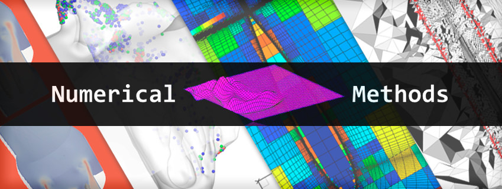

# Numerical Methods for Computers
Offical Repository of RMUTT 09131201 Numerical Methods for Computers

Lecturers:
 - Ratthaprom PROMKAM, Asst. Prof., Dr. rer. nat.




## Schedules

SEMESTER 1/2569

| Section | Date    | Lecture  | Workshop | Line Group | [D-Learn](https://dlearn.rmutt.ac.th/course/view.php?id=2318) Key |
|---------|---------|----------|----------|--------|---------|
|  SEC01  | อังคาร     |ST1905 เวลา 08.00 - 10.00 | ST1905 เวลา 10.00 - 12.00 | [Join](https://line.me/ti/g/_JVbcbnLBP) | TBA  |
|  SEC02  | พุธ     |ST1905 เวลา 08.00 - 10.00 | ST1905 เวลา 10.00 - 12.00 | [Join](https://line.me/ti/g/4pAUaY_9nk) | TBA  |
|  SEC03  | พฤหัสบดี     | ST1905 เวลา 08.00 - 10.00 | ST1905 เวลา 10.00 - 12.00 | [Join](https://line.me/ti/g/UkpKh3RbU8) | TBA  |


## Examinations

| Section | MIDTERM | FINAL  | Location|
|---------|---------|-------|---------|
| SEC 01-03 | 1 ก.ย. 2569 เวลา 09:00 - 12:00  | 27 ต.ค. 2569 เวลา 09:00 - 12:00 | อาคาร ทสม ห้อง ST5-703/704 |

 


## Course Description

เครื่องมือสำหรับแก้ปัญหาเชิงตัวเลข การวิเคราะห์ความคลาดเคลื่อน ผลเฉลยของสมการแบบไม่เชิงเส้น ผลเฉลยของระบบสมการเชิงเส้น การประมาณค่าในช่วง การประมาณค่ากำลังสองน้อยที่สุด อนุพันธ์และปริพันธ์เชิงตัวเลข ผลเฉลยเชิงตัวเลขของสมการเชิงอนุพันธ์ การแก้ปัญหาเชิงตัวเลขด้วยคอมพิวเตอร์ และการประยุกต์ใช้เครื่องมือสำหรับแก้ปัญหาเชิงตัวเลข

Tools for numerical problem solving, error analysis, solutions of nonlinear equations, solution of systems of linear equations, interpolation, least square approximation, numerical diffentiation and integration, numerical solution of differential equations, numerical problem solving by computer, applying in tools for numerical problem solving


## Course Learning Outcomes

1. บอกความหมายของความคลาดเคลื่อนได้ 
1. คำนวณผลเฉลยของสมการไม่เชิงเส้นโดยวิธีแบ่งครึ่งช่วง วิธีวางผิดที่ วิธีทำซ้ำ วิธีนิวตัน วิธีซีแคนต์ได้ 
1. คำนวณผลเฉลยของระบบสมการเชิงเส้นได้
1. คำนวณการประมาณค่าในช่วงด้วยวิธีนิวตันและวิธีลากรองจ์ได้
1. คำนวณการประมาณค่าแบบกำลังสองน้อยสุดได้
1. คำนวณค่าอนุพันธ์เชิงตัวเลขได้
1. คำนวณค่าปริพันธ์เชิงตัวเลขได้
1. เขียนโปรแกรมคอมพิวเตอร์ในการคํานวณด้านระเบียบวิธีเชิงตัวเลขเบื้องต้นได้


## Class Materials

|    Topic   |   Description   |    Material/Workshop   |
|------------|-----------------|---------------|
| [Erorrs and Approximation](./materials/lecture_01.pdf) | ค่าคลาดเคลื่อนและค่าประมาณ | [Handout](./materials/handout_01.pdf) <br> [Workshop 01](./materials/workshop_01.ipynb) |
| [Root Finding](./materials/lecture_02.pdf) | รากของสมการ | [Handout](./materials/handout_02.pdf) <br> [Workshop 02](./materials/workshop_02.ipynb) <br>  [Workshop 03](./materials/workshop_03.ipynb)|
| [Systems of Linear Equations](./materials/lecture_03.pdf) | ระบบสมการเชิงเส้น | [Handout](./materials/handout_03.pdf) <br> [Workshop 04](./materials/workshop_04.ipynb) <br> [Workshop 05](./materials/workshop_05.ipynb) <br> [Workshop 06](./materials/workshop_06.ipynb) <br> [Workshop 07](./materials/workshop_07.ipynb)|
| [Regression](./materials/lecture_04.pdf) | สมการถดถอย | [Handout](./materials/handout_04.pdf) <br> [Workshop 08](./materials/workshop_08.zip) <br> [Workshop 09](./materials/workshop_09.zip) |
| [Interpolation](./materials/lecture_05.pdf) | การประมาณค่าในช่วง | [Handout](./materials/handout_05.pdf) <br> [Workshop 10](./materials/workshop_10.ipynb) <br> [Workshop 11](./materials/workshop_11.zip) |
| [Numerical Differentiation and Integration](./materials/lecture_06.pdf) | อนุพันธ์เชิงตัวเลข | [Handout](./materials/handout_06.pdf) <br> [Workshop 12](./materials/workshop_12.ipynb) <br> [Workshop 13](./materials/workshop_13.ipynb) |


## Grades

คะแนนเต็ม 100 คะแนน โดยแบ่งออกเป็น
- การสอบกลางภาค 25%
- การสอบปลายภาค 25%
- การสอบย่อย 25%
- งานที่ได้รับมอบหมาย 25%

หากนักศึกษาเข้าเรียนน้อยกว่า 80% ของเวลาเรียนทั้งหมด
หรือได้คะแนนรวมน้อยกว่า 50% ของคะแนนเต็ม นักศึกษาจะไม่ผ่านในรายวิชานี้ และได้รับการบันทึกผลการเรียน F (เกรด 0.0) 

สำหรับนักศึกษาที่ผ่านเกณฑ์ดังกล่าว จะได้รับการบันทึกผลการเรียนตามเกณฑ์ของคะแนน t-score 

```
t-score = 50 + 10*(x - u)/s
```
เมื่อ x คือคะแนนรวม, u คือคะแนนเฉลี่ยของคะแนนรวม และ s คือส่วนเบี่ยงเบนมาตรฐานของคะแนนรวม

ดังนี้

| ผลการเรียน | เกรด | เกณฑ์ t-score |
|---------|------|--------------|
| F | 0.00 | (-Inf, 50) | 
| D | 1.00 | [50, 55) | 
| D+ | 1.50 | [55, 60) | 
| C | 2.00 | [60, 65) |
| C+ | 2.50 | [65, 70) |
| B | 3.00 | [70, 75) |
| B+ | 3.50 | [75, 80) |
| A | 4.00 | [80, Inf) |

## References

- Burden, R. L., & Faires, J. D. (2010). Numerical Analysis (9 edition). Cengage Learning.
- Sauer, T. (2011). Numerical Analysis (2nd edition). Pearson.
- Chapra, S. C., & Canale, R. P. (2021). Numerical Methods for Engineers (8th edition). McGraw-Hill.
- ปราโมทย์ เดชะอำไพ และนิพนธ์ วรรณโสภาคย์, (2010) ระเบียบวิธีเชิงตัวเลขในงานวิศวกรรม, สำนักพิมพ์จุฬาลงกรณ์มหาวิทยาลัย
- วรสิทธิ์ กาญจนกิจเกษม, (2014) ระเบียบวิธีเชิงตัวเลข, สำนักพิมพ์จุฬาลงกรณ์มหาวิทยาลัย
- Heath, M. T. (2018). Scientific Computing: An Introductory Survey (Revised 2nd edition). Society for Industrial and Applied Mathematics (SIAM).
